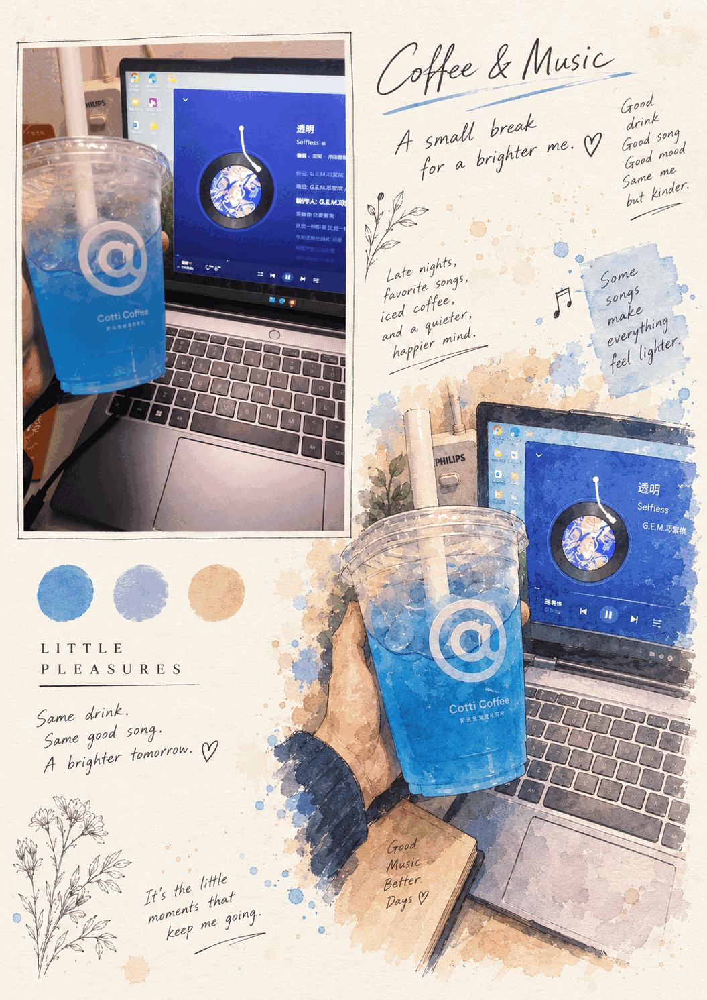
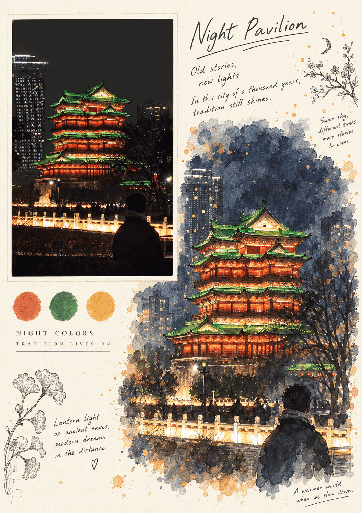
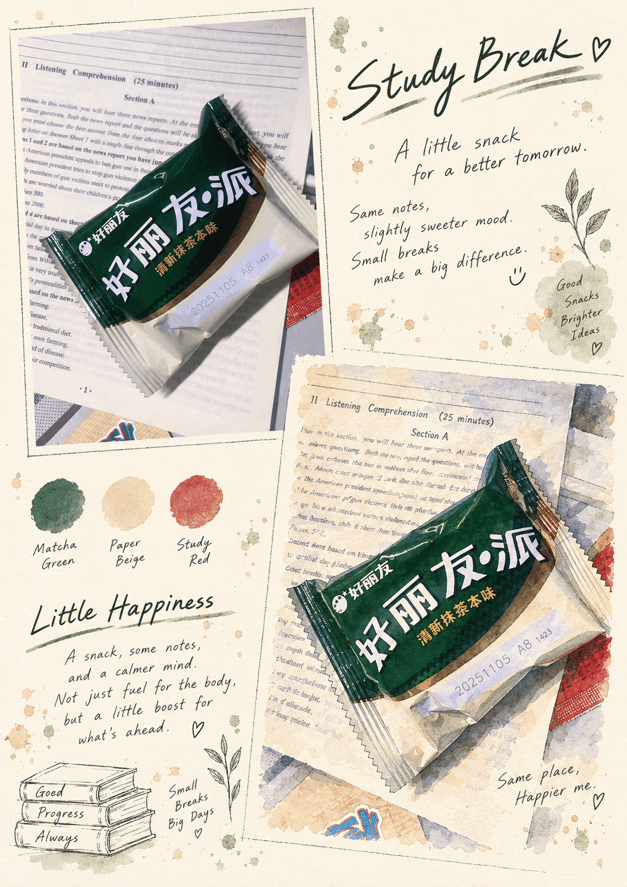

# Photo to XP Postcard

> 将照片自动转换为奶油纸质感的水彩手绘明信片，并生成取景框、场景标签和专属配色卡。每张照片独立处理，不会合并多张图片。

## 项目介绍

这是一个用于生成「水彩明信片风格照片学习卡」的 ChatGPT Skill。

用户只需要上传一张或多张照片，Skill 就会分析每张照片的主体、构图、色彩和场景氛围，并为每张照片分别生成一张统一版式的明信片作品。

生成结果会保留原照片的重要内容，同时加入奶油色纸张背景、水彩与彩铅手绘效果、简洁场景标签，以及从原图提取的代表性色卡。即使一次上传多张照片，也会逐张独立生成，不会把不同照片合并到同一张作品中。

## 示例

| 示例 1 | 示例 2 |
| --- | --- |
|  |  |
|  |  |
|  |  |

## 主要功能

- 将真实照片转换为水彩与彩铅结合的手绘风格
- 保留原图主体、场景、构图和视觉特征
- 自动生成统一的奶油纸明信片版式
- 同时展示原始场景与艺术化重绘效果
- 根据照片内容生成简洁的场景标签
- 从原图提取三种代表性色彩
- 支持人物、风景、建筑、街景、宠物等不同题材
- 支持一次上传多张照片
- 每张照片独立生成，绝不拼接或合并
- 保持不同作品之间的版式与视觉风格统一
- 支持根据用户要求调整比例、标题和文字语言

## 安装

在 Codex 中输入：

```text
$skill-installer https://github.com/yzk203409-prog/photo-to-xp-postcard
```

## 使用说明

上传一张或多张照片，并提出以下类似要求：

> 请把这些照片制作成水彩明信片学习卡，每张照片分别生成，不要合并。

Skill 会将每张输入图片识别为一个独立任务，并分别输出对应的明信片作品。

也可以直接指定 Skill：

```text
使用 $photo-to-xp-postcard 将我上传的每张照片分别生成一张明信片研究页。
```

## English Introduction

> A ChatGPT Skill that transforms uploaded photos into cream-paper postcard study sheets featuring a faithful framed scene, a watercolor-and-pencil reinterpretation, minimalist labels, and three scene-derived color swatches. Each uploaded photo is processed and generated separately—multiple images are never merged into one composition.

## 文件结构

```text
.
├── SKILL.md
├── agents/
│   └── openai.yaml
└── assets/
    ├── icon.svg
    ├── example-01.png
    ├── example-02.png
    ├── example-03.png
    ├── example-04.png
    ├── example-05.png
    └── example-06.png
```
