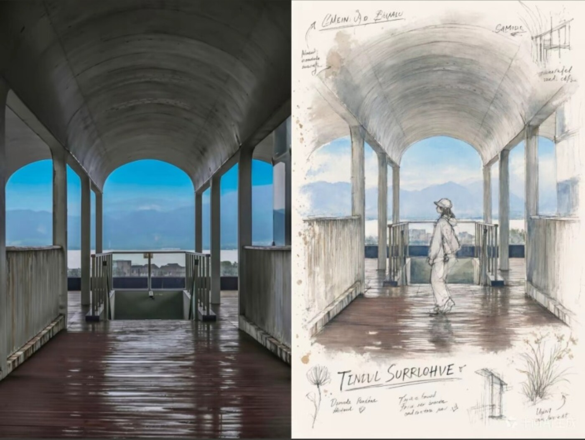

# Photo to XP Postcard

把普通照片转换成统一风格的奶油纸水彩明信片研究页，适用于 ChatGPT 和 Codex。



## 功能

- 每张上传照片单独生成一张成品，绝不把多张照片合并。
- 上方保留忠于原图的框景画面。
- 右下生成同一场景的水彩与铅笔手绘稿。
- 左下加入简约标题、说明文字和三个取自原图的配色圆点。
- 多张照片按上传顺序输出，并保持统一的系列风格。
- 支持根据用户要求调整比例、标题和文字语言。

## 安装

在 Codex 中输入：

```text
$skill-installer https://github.com/yzk203409-prog/photo-to-xp-postcard
```

## 使用

```text
使用 $photo-to-xp-postcard 将我上传的每张照片分别生成一张明信片研究页。
```

也可以直接上传图片，并说明“按照明信片研究页格式生成”。

## 文件结构

```text
.
├── SKILL.md
├── agents/
│   └── openai.yaml
└── assets/
    ├── icon.svg
    └── photo-to-sketch-reference.jpg
```
